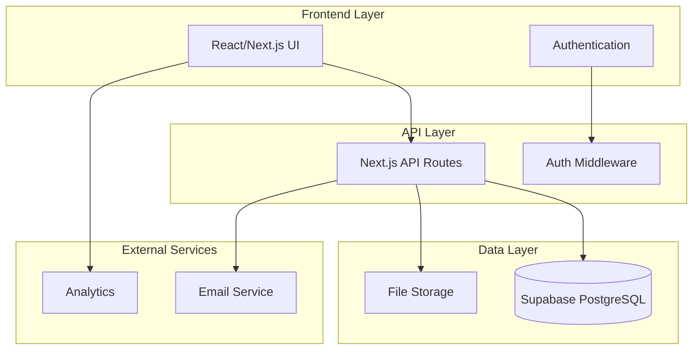

# Design Document: GoG Player Assembly

## Overview

GoG Player Assembly è una piattaforma web che facilita la rappresentanza strutturata della comunità di Guns of Glory attraverso un sistema di rappresentanti server. La piattaforma fornisce strumenti per la gestione delle proposte, il voto democratico, la raccolta di feedback e la misurazione del sentiment della comunità attraverso il Community Spending Propensity Index (CSPI).

L'architettura è progettata per essere scalabile, sicura e trasparente, con particolare attenzione alla neutralità e alla prevenzione di qualsiasi coordinamento di azioni.

## Architecture

### High-Level Architecture



### Technology Stack

- **Frontend**: Next.js 14 with React, TypeScript, Tailwind CSS
- **Backend**: Next.js API Routes with TypeScript
- **Database**: Supabase (PostgreSQL) with Row Level Security
- **Authentication**: Supabase Auth
- **Deployment**: Vercel
- **Email**: Resend or similar service
- **Analytics**: Vercel Analytics

## Components and Interfaces

### Core Components

#### 1. Authentication System

- **Server Representative Registration**: Verifica dell'affiliazione al server
- **Role-based Access Control**: Differenti permessi per rappresentanti e amministratori
- **Session Management**: Gestione sicura delle sessioni utente

#### 2. Representative Management

- **Profile Management**: Gestione profili rappresentanti
- **Server Verification**: Sistema di verifica dell'affiliazione al server
- **Activity Tracking**: Monitoraggio dell'attività dei rappresentanti

#### 3. Proposal System

- **Proposal Creation**: Interface per creare nuove proposte
- **Categorization**: Sistema di categorizzazione automatica e manuale
- **Proposal Lifecycle**: Gestione degli stati delle proposte (Draft, Active, Voting, Approved, Rejected)

#### 4. Voting System

- **Ballot Management**: Gestione dei voti con prevenzione duplicati
- **Quorum Calculation**: Calcolo automatico del quorum (60% partecipazione)
- **Results Processing**: Elaborazione e presentazione dei risultati

#### 5. Feedback Collection

- **Feedback Submission**: Interface per sottomissione feedback
- **Categorization Engine**: Categorizzazione automatica del feedback
- **Aggregation Tools**: Strumenti per aggregare feedback simili

#### 6. CSPI System

- **Propensity Declaration**: Interface per dichiarare il livello di propensione del server
- **Index Calculation**: Calcolo del CSPI normalizzato
- **Historical Tracking**: Tracciamento storico dei valori CSPI

#### 7. Communication Hub

- **Messaging System**: Sistema di messaggistica sicura tra rappresentanti
- **Notification System**: Sistema di notifiche per eventi importanti
- **Discussion Threads**: Thread di discussione per argomenti specifici

#### 8. Reporting System

- **Analytics Dashboard**: Dashboard con metriche chiave
- **Report Generation**: Generazione di report strutturati
- **Data Export**: Esportazione dati in formati standard

### Data Models

#### User Model

```typescript
interface User {
  id: string
  email: string
  name: string
  server_id: string
  role: 'representative' | 'admin'
  verified: boolean
  created_at: Date
  last_active: Date
}
```

#### Server Model

```typescript
interface Server {
  id: string
  name: string
  region: string
  representative_id?: string
  active: boolean
  created_at: Date
}
```

#### Proposal Model

```typescript
interface Proposal {
  id: string
  title: string
  description: string
  category: 'gameplay' | 'economy' | 'events' | 'technical'
  author_id: string
  status: 'draft' | 'active' | 'voting' | 'approved' | 'rejected'
  voting_deadline?: Date
  created_at: Date
  updated_at: Date
}
```

#### Vote Model

```typescript
interface Vote {
  id: string
  proposal_id: string
  representative_id: string
  vote: 'approve' | 'reject' | 'abstain'
  created_at: Date
}
```

#### Feedback Model

```typescript
interface Feedback {
  id: string
  content: string
  category: string
  server_id: string
  representative_id: string
  related_proposal_id?: string
  created_at: Date
}
```

#### CSPI Declaration Model

```typescript
interface CSPIDeclaration {
  id: string
  server_id: string
  representative_id: string
  propensity_level: 0 | 1 | 2 | 3 | 4
  reasoning?: string
  created_at: Date
}
```

#### CSPI Snapshot Model

```typescript
interface CSPISnapshot {
  id: string
  value: number // 0-1 normalized
  participating_servers: number
  total_servers: number
  created_at: Date
}
```

### API Interfaces

#### Authentication Endpoints

- `POST /api/auth/register` - Registrazione rappresentante
- `POST /api/auth/verify-server` - Verifica affiliazione server
- `GET /api/auth/profile` - Profilo utente corrente

#### Proposal Endpoints

- `GET /api/proposals` - Lista proposte con filtri
- `POST /api/proposals` - Crea nuova proposta
- `PUT /api/proposals/:id` - Aggiorna proposta
- `POST /api/proposals/:id/vote` - Vota su proposta

#### CSPI Endpoints

- `POST /api/cspi/declare` - Dichiara propensione server
- `GET /api/cspi/current` - CSPI corrente
- `GET /api/cspi/history` - Storico CSPI

#### Feedback Endpoints

- `POST /api/feedback` - Sottometti feedback
- `GET /api/feedback` - Lista feedback con filtri
- `PUT /api/feedback/:id/aggregate` - Aggrega feedback simili

## Error Handling

### Error Categories

1. **Authentication Errors**
   - Invalid credentials
   - Unverified server affiliation
   - Insufficient permissions

2. **Validation Errors**
   - Invalid proposal format
   - Duplicate votes
   - Missing required fields

3. **Business Logic Errors**
   - Voting on expired proposals
   - Quorum not met
   - Server already has representative

4. **System Errors**
   - Database connection issues
   - External service failures
   - Rate limiting

### Error Response Format

```typescript
interface ErrorResponse {
  error: {
    code: string
    message: string
    details?: any
  }
  timestamp: Date
  request_id: string
}
```

### Error Handling Strategy

- **Client-side**: Toast notifications per errori utente, fallback UI per errori di sistema
- **Server-side**: Structured logging, error monitoring, graceful degradation
- **Database**: Transaction rollbacks, constraint violations handling
- **External Services**: Retry logic, circuit breakers, fallback mechanisms

## Correctness Properties

_A property is a characteristic or behavior that should hold true across all valid executions of a system-essentially, a formal statement about what the system should do. Properties serve as the bridge between human-readable specifications and machine-verifiable correctness guarantees._

### Property 1: Representative Registration Integrity

_For any_ valid server representative registration data, the system should successfully verify server affiliation and create a complete profile with correct server association.
**Validates: Requirements 1.1**

### Property 2: Permission Update Consistency

_For any_ representative status change, the system should update permissions correctly and deliver notifications to all relevant parties.
**Validates: Requirements 1.2**

### Property 3: Single Representative Invariant

_For any_ sequence of representative management operations, each server should have exactly one active representative at all times.
**Validates: Requirements 1.3**

### Property 4: Inactivity Flagging Accuracy

_For any_ representative account, if inactive for 30 days, the system should flag the account for review with correct timing.
**Validates: Requirements 1.4**

### Property 5: Proposal Validation and Storage

_For any_ valid proposal submitted by a representative, the system should validate the format and store it correctly for community review.
**Validates: Requirements 2.1**

### Property 6: Proposal Notification Delivery

_For any_ submitted proposal, all other representatives should receive voting notifications.
**Validates: Requirements 2.2**

### Property 7: Proposal Categorization Accuracy

_For any_ proposal content, the system should categorize it correctly into one of the four defined types (gameplay, economy, events, technical).
**Validates: Requirements 2.3**

### Property 8: Majority Support Status Update

_For any_ proposal that receives majority support, the system should mark it as "Community Approved" when the threshold is reached.
**Validates: Requirements 2.4**

### Property 9: Vote Recording Completeness

_For any_ vote cast by a representative, the system should record it with accurate timestamp and representative identity.
**Validates: Requirements 3.1**

### Property 10: Duplicate Vote Prevention

_For any_ representative and proposal combination, only the first vote should be recorded, with subsequent attempts being rejected.
**Validates: Requirements 3.2**

### Property 11: Voting Period Result Calculation

_For any_ proposal with an expired voting period, the system should calculate results and update proposal status correctly.
**Validates: Requirements 3.3**

### Property 12: Quorum Validation

_For any_ proposal vote, the result should only be considered valid if at least 60% of servers participated.
**Validates: Requirements 3.4**

### Property 13: Feedback Association and Categorization

_For any_ submitted feedback, the system should correctly associate it with the representative's server and categorize it appropriately.
**Validates: Requirements 4.1**

### Property 14: Feedback Aggregation Functionality

_For any_ set of similar feedback items, representatives should be able to aggregate them while preserving the original content.
**Validates: Requirements 4.2**

### Property 15: Automatic Proposal-Feedback Linking

_For any_ feedback that relates to existing proposals, the system should automatically create appropriate links between them.
**Validates: Requirements 4.3**

### Property 16: Feedback Analytics Accuracy

_For any_ collection of feedback data, the system should generate accurate analytics on trends and common issues.
**Validates: Requirements 4.4**

### Property 17: CSPI Declaration Storage

_For any_ valid spending propensity declaration by a server representative, the system should store it correctly with proper server association.
**Validates: Requirements 5.1**

### Property 18: CSPI Scale Validation

_For any_ spending propensity declaration, the system should only accept values within the predefined ordinal scale (0-4).
**Validates: Requirements 5.2**

### Property 19: CSPI Calculation Accuracy

_For any_ set of server-level spending propensity declarations, the system should calculate the normalized CSPI using the correct formula: CSPI = (Σ server_propensity) / (N_servers \* max_scale).
**Validates: Requirements 5.3**

### Property 20: CSPI Presentation Neutrality

_For any_ CSPI value, the system should present it with descriptive and informational context without actionable recommendations.
**Validates: Requirements 5.4**

### Property 21: CSPI Historical Record Maintenance

_For any_ CSPI calculation, the system should maintain historical snapshots with timestamps for future analysis.
**Validates: Requirements 5.5**

### Property 22: Coordination Tool Absence

_For any_ system functionality, there should be no coordination tools, instructions, or recommendations related to spending behavior.
**Validates: Requirements 5.6**

### Property 23: Secure Messaging Delivery

_For any_ message sent between representatives, it should be delivered securely only to the intended recipient.
**Validates: Requirements 6.1**

### Property 24: Broadcast Notification Coverage

_For any_ urgent broadcast notification, all active representatives should receive it.
**Validates: Requirements 6.2**

### Property 25: Discussion Thread Persistence

_For any_ ongoing discussion topic, the system should maintain the thread structure and message history correctly.
**Validates: Requirements 6.3**

### Property 26: Communication Archival Completeness

_For any_ communication in the system, it should be archived and remain retrievable for future reference.
**Validates: Requirements 6.4**

### Property 27: Report Generation Accuracy

_For any_ proposal and voting data, the system should generate accurate reports on success rates and voting patterns.
**Validates: Requirements 7.1**

### Property 28: Activity Tracking Precision

_For any_ representative activity, the system should track it accurately and reflect correct participation levels.
**Validates: Requirements 7.2**

### Property 29: Sentiment Analysis Historical Context

_For any_ significant community sentiment shift, the system should analyze it with appropriate historical context and impact assessment.
**Validates: Requirements 7.3**

### Property 30: Community Health Metrics Accuracy

_For any_ community data, the dashboard should display accurate health metrics calculated from the underlying data.
**Validates: Requirements 7.4**

### Property 31: Developer Report Neutrality

_For any_ community-approved proposal, the generated developer report should maintain neutral language and structured format.
**Validates: Requirements 8.1**

### Property 32: Participation Metrics Calculation

_For any_ community activity data, the system should calculate participation metrics and consensus indicators accurately.
**Validates: Requirements 8.2**

### Property 33: Developer Response Integrity

_For any_ developer response submitted to the system, it should be recorded exactly as provided without editorial modification.
**Validates: Requirements 8.3**

### Property 34: Proposal Status Management

_For any_ proposal, the system should allow it to be marked as Accepted, Rejected, or Deferred with proper status tracking.
**Validates: Requirements 8.4**

### Property 35: Developer Engagement Pattern Tracking

_For any_ developer interaction with the system, it should be tracked to provide historical visibility into engagement patterns.
**Validates: Requirements 8.5**

## Testing Strategy

### Unit Testing

- **Component Testing**: React components con React Testing Library
- **API Testing**: Endpoint testing con Jest e Supertest
- **Utility Functions**: Pure function testing
- **Database Models**: Model validation e constraint testing

### Property-Based Testing

- **Minimum 100 iterations** per property test
- **Library**: fast-check per TypeScript/JavaScript
- **Tag format**: `Feature: gog-player-assembly, Property {number}: {property_text}`

La strategia di testing combina unit tests per esempi specifici e casi limite con property-based tests per verificare proprietà universali su tutti gli input possibili. Entrambi i tipi di test sono complementari e necessari per una copertura completa.

### Integration Testing

- **API Integration**: End-to-end API testing
- **Database Integration**: Database operation testing
- **Authentication Flow**: Complete auth flow testing
- **Email Integration**: Email service integration testing

### End-to-End Testing

- **User Workflows**: Complete user journey testing
- **Cross-browser Testing**: Multi-browser compatibility
- **Mobile Responsiveness**: Mobile device testing
- **Performance Testing**: Load and stress testing
